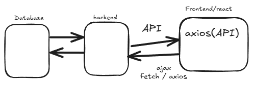

---

# 📘 Notes on API in React

## 1. What is an API?

* **API (Application Programming Interface)**: A way for applications to communicate with each other.
* In React, we often use **REST APIs** or **GraphQL APIs** to fetch data from a backend/server and display it on the frontend.

Example:

* A weather app calls a weather API to get temperature, humidity, etc.
* A shopping app fetches products from a fake API like `https://fakestoreapi.com/products`.

---

## 2. Why use APIs in React?

* React is just the **UI library** → It doesn’t handle data storage by itself.
* APIs help React apps:

  * Get data from servers (products, users, posts, etc.)
  * Send data to servers (login info, form submissions, etc.)
  * Update or delete existing data.

---

## 3. Ways to Call APIs in React

There are multiple ways to fetch data in React:

### (a) Using **Fetch API** (Native JS)

```jsx
useEffect(() => {
  fetch("https://fakestoreapi.com/products")
    .then(response => response.json())
    .then(data => setProducts(data))
    .catch(err => console.log(err));
}, []);
```

### (b) Using **Axios** (Popular library)

```jsx
import axios from "axios";

useEffect(() => {
  axios.get("https://fakestoreapi.com/products")
    .then(res => setProducts(res.data))
    .catch(err => console.log(err));
}, []);
```

👉 Axios is preferred because:

* Easier syntax
* Automatic JSON parsing
* Better error handling

---

## 4. React Hooks with APIs

### (a) `useState` – Store data

```jsx
const [products, setProducts] = useState([]);
const [loading, setLoading] = useState(true);
const [error, setError] = useState(null);
```

### (b) `useEffect` – Call API on mount

```jsx
useEffect(() => {
  axios.get("https://fakestoreapi.com/products")
    .then(res => {
      setProducts(res.data);
      setLoading(false);
    })
    .catch(err => {
      setError(err.message);
      setLoading(false);
    });
}, []);
```

---

## 5. API Request Types in React

1. **GET** → Fetch data
2. **POST** → Send data
3. **PUT/PATCH** → Update existing data
4. **DELETE** → Remove data

Example (POST request):

```jsx
axios.post("https://fakestoreapi.com/products", {
  title: "New Product",
  price: 99.99
})
.then(res => console.log(res.data))
.catch(err => console.log(err));
```

---

## 6. Handling Loading and Errors

Always handle:

* **Loading state** (Show spinner or "Loading...")
* **Error state** (Show error message)

Example:

```jsx
if (loading) return <h2>Loading...</h2>;
if (error) return <h2>Error: {error}</h2>;
```

---

## 7. Displaying API Data

```jsx
return (
  <div>
    {products.map((p) => (
      <div key={p.id}>
        <h3>{p.title}</h3>
        <p>${p.price}</p>
      </div>
    ))}
  </div>
);
```

---

## 8. Best Practices

✅ Always use `try-catch` (if using async/await).
✅ Use `loading` and `error` states.
✅ Separate API logic into a **service file**. Example:

```jsx
// api.js
import axios from "axios";
const API_URL = "https://fakestoreapi.com/products";

export const getProducts = () => axios.get(API_URL);
```

Then in your component:

```jsx
useEffect(() => {
  getProducts()
    .then(res => setProducts(res.data))
    .catch(err => console.log(err));
}, []);
```

✅ Use **custom hooks** for reusable API logic (advanced).

---

## 9. Advanced Topics

* **React Query / TanStack Query** → For advanced state + API handling
* **SWR** → Simple fetching with caching
* **Error Boundaries** → Handle API failures gracefully
* **Authentication with APIs** → Handling tokens, headers, JWTs

---

# 📌 Quick Summary

1. API helps React apps get/send data.
2. Use `fetch` or `axios` for API calls.
3. Manage states (`loading`, `error`, `data`) using `useState` + `useEffect`.
4. Handle **CRUD operations**: GET, POST, PUT, DELETE.
5. Follow best practices (custom hooks, services, error handling).

---

